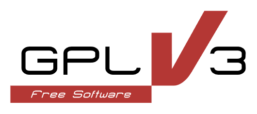

# **Study-PY™  Version 1.0.0  12/10/2022**

" width="160"/> 
[(*see licensing information*)](#licensing)
  

#### Study-PY

- Study-PY is a program capable of taking data from .txt and .csv files and performing a multitude of sorting, graphing, and optimization functions to organize data into an easy to understand visual format. This is all done by the user through an intuitive user interface, or a batch interface used alongside a user created text file.

___

#### GENERAL USAGE NOTES:

- **Study-PY only supports comma-delimited text (.txt) files or comma-separated value (.csv) files** such that the **first line of the file denotes column headers for the data contained in the columns below**

- **Study-PY can be used with data files other than the "student-mat.csv"** for which it was created and will support column headers of different values than those found in the "student-mat.csv" file included with the software, however **not all features may be supported** depending on the data file used.

- Study-PY will never alter the original data file

___

#### Installation / Running Study-PY software:

- To **download a local copy of Study-PY** for your own use:
  - go to: [Study-PY public GitHub repository](https://github.com/InochiFumetsu/district_12)
  - on the right side of the page, look for **"releases"** and click on **"tags"**
  - download **version 1.0.0** and extract the .zip folder contents to your desired location
  - open a **command line** interface and navigate to the directory where you unpacked the .zip file, above
    - in the command line, type: 
    `py T012_M3_text_ui.py` 
    and hit `<ENTER>`
    - if you would like to use the **batch-ui mode**, instead of the above step, type: 
    `py T012_M3_batch_ui.py` in the command line 
    and hit `<ENTER>`

- Study-PY is written in Python and, as such, **no "installation" is necessary**, however, please note, in order to be able to use Study-PY you:
  - **Must have the latest version of Python installed** 
    *for installation instructions see*:

    > https://docs.python.org/3/using/index.html

    - be sure to add python to the local PATH variable during installation  
  - **Must have the following python modules installed**: 
    (*minimum versions listed next to modules*)
    - **numpy** (v1.23.5)
         cmd line: `pip install numpy` and hit `<ENTER>`
    - **matplotlib** (v3.6.2)
         cmd line: `pip install matplotlib` and hit `<ENTER>`
    - **scipy** (v1.9.3)
      cmd line: `pip install scipy` and hit `<ENTER>`

_for general instructions on installing python modules see_:

  > https://docs.python.org/3/installing/index.html

___

#### Using Study-PY:

- Study-PY's batch interface and user interface include prompts and instructions to guide the user through using the program. Aslong as all instructions are followed, the program will run as intended. Ensure all instructions were followed from the Installation/Running section above before attempting to use the program. Also ensure that before use a .txt or .csv file is prepared with the first row consisting of headers and each of the corresponding columns are values of that header. Before using the batch interface prepare a .txt file where each line (ordered) is a line of commands seperated by semicolons.

___

#### Developers:

- **Study-PY is not open for continued development**, however, **developers are welcome to** fork or otherwise clone the Study-PY repository and either modify existing code or **continue development to suit their own purposes** [(*see licensing information, below*)](#licensing).

___

#### Study-PY development team can be reached c/o:

|Esteban Heidrich||Project Development Lead|
|---|---|---|
|**Voice**:||(613) 520-2600 ext. 5790|
|**WebSite**:||[Study-PY public GitHub repository](https://github.com/InochiFumetsu/district_12)|
|**Email**:||<117683649+Hey1121@users.noreply.github.com>|

___

#### Credits

##### Functions by Module:
 - **T012_M1_load_data.py:**
    function [*author reference (table, below)*]
    - student_school_dictionary() [[1]](#1)
    - student_health_dictionary() [[3]](#3)
    - student_age_dictionary() [[4]](#4)
    - student_failures_dictionary() [[2]](#2)
    - load_data() [[1]](#1)
    - add_average [[4]](#4)
 - **check_equal.py:**
    function [*author reference (table, below)*]
     - check_equal() [[4]](#4)
     - check_equal_dict_keys() [[1]](#1)
     - check_no_entries_by_key() [[4]](#4)
     - type_test() [[2]](#2)
     - check_add_average() [[3]](#3)
 - **T012_M2_sort_plot.py:**
    function [*author reference (table, below)*]
     - student_list() [[4]](#4)
     - sort_students_bubble() [[3]](#3)
     - sort_students_selection() [[2]](#2)
     - curve_fit() [[4]](#4)
     - histogram() [[1]](#1)
 - **T012_M3_optimization.py:**
    function [*author reference (table, below)*]
     - quadratic() [[3]](#3)
     - evaluate_negate_quadratic() [[4]](#4)
     - minimum() [[3]](#3)
     - maximum() [[4]](#4)
 - **T012_M3_text_ui.py:**
    function [*author reference (table, below)*]
     - **JACK FUNCTIONS ETC. HERE**
 - **T012_M3_batch_ui.py:**
    function [*author reference (table, below)*]
     - batch_ui() [[1]](#1)

##### Authors:

|||||||
|---|---|---|---|---|---|
|<a name="1">[1]</a>|Esteban Heidrich||101267959||Project Lead|
|<a name="2">[2]</a>|Jack Roberts||101261505||Developer|
|<a name="3">[3]</a>|Milan Djordjevic||101262178||Developer|
|<a name="4">[4]</a>|Spencer Hiscox||101230073||Developer|

___

#### <a name="licensing">Licensing and Copyright</a>

##### Study-PY
© Copyright 2022, Esteban Heidrich, Jack Roberts, Milan Djordjevic, Spencer Hiscox. All rights reserved.
Study-PY™ is a trademark of district_12™ developers.
  

Study-PY is free software: you can redistribute it and/or modify it under the terms of the GNU General Public License as published by the Free Software Foundation, either version 3 of the License, or (at your option) any later version.

Study-PY is distributed in the hope that it will be useful, but WITHOUT ANY WARRANTY; without even the implied warranty of MERCHANTABILITY or FITNESS FOR A PARTICULAR PURPOSE. See the GNU General Public License for more details.

You should have received a copy of the GNU General Public License along with this program. If not, see <https://www.gnu.org/licenses/>.

___

##### NumPy

Copyright © 2005-2022, NumPy Developers.
All rights reserved.
  

Redistribution and use in source and binary forms, with or without
modification, are permitted provided that the following conditions are
met:

  * Redistributions of source code must retain the above copyright
       notice, this list of conditions and the following disclaimer.

  * Redistributions in binary form must reproduce the above
       copyright notice, this list of conditions and the following
       disclaimer in the documentation and/or other materials provided
       with the distribution.

  * Neither the name of the NumPy Developers nor the names of any
       contributors may be used to endorse or promote products derived
       from this software without specific prior written permission.

THIS SOFTWARE IS PROVIDED BY THE COPYRIGHT HOLDERS AND CONTRIBUTORS
"AS IS" AND ANY EXPRESS OR IMPLIED WARRANTIES, INCLUDING, BUT NOT
LIMITED TO, THE IMPLIED WARRANTIES OF MERCHANTABILITY AND FITNESS FOR
A PARTICULAR PURPOSE ARE DISCLAIMED. IN NO EVENT SHALL THE COPYRIGHT
OWNER OR CONTRIBUTORS BE LIABLE FOR ANY DIRECT, INDIRECT, INCIDENTAL,
SPECIAL, EXEMPLARY, OR CONSEQUENTIAL DAMAGES (INCLUDING, BUT NOT
LIMITED TO, PROCUREMENT OF SUBSTITUTE GOODS OR SERVICES; LOSS OF USE,
DATA, OR PROFITS; OR BUSINESS INTERRUPTION) HOWEVER CAUSED AND ON ANY
THEORY OF LIABILITY, WHETHER IN CONTRACT, STRICT LIABILITY, OR TORT
(INCLUDING NEGLIGENCE OR OTHERWISE) ARISING IN ANY WAY OUT OF THE USE
OF THIS SOFTWARE, EVEN IF ADVISED OF THE POSSIBILITY OF SUCH DAMAGE.

___

##### SciPy

Copyright © 2001-2002 Enthought, Inc. 2003-2022, SciPy Developers.
All rights reserved.
  

Redistribution and use in source and binary forms, with or without
modification, are permitted provided that the following conditions
are met:

1. Redistributions of source code must retain the above copyright
   notice, this list of conditions and the following disclaimer.

2. Redistributions in binary form must reproduce the above
   copyright notice, this list of conditions and the following
   disclaimer in the documentation and/or other materials provided
   with the distribution.

3. Neither the name of the copyright holder nor the names of its
   contributors may be used to endorse or promote products derived
   from this software without specific prior written permission.

THIS SOFTWARE IS PROVIDED BY THE COPYRIGHT HOLDERS AND CONTRIBUTORS
"AS IS" AND ANY EXPRESS OR IMPLIED WARRANTIES, INCLUDING, BUT NOT
LIMITED TO, THE IMPLIED WARRANTIES OF MERCHANTABILITY AND FITNESS FOR
A PARTICULAR PURPOSE ARE DISCLAIMED. IN NO EVENT SHALL THE COPYRIGHT
OWNER OR CONTRIBUTORS BE LIABLE FOR ANY DIRECT, INDIRECT, INCIDENTAL,
SPECIAL, EXEMPLARY, OR CONSEQUENTIAL DAMAGES (INCLUDING, BUT NOT
LIMITED TO, PROCUREMENT OF SUBSTITUTE GOODS OR SERVICES; LOSS OF USE,
DATA, OR PROFITS; OR BUSINESS INTERRUPTION) HOWEVER CAUSED AND ON ANY
THEORY OF LIABILITY, WHETHER IN CONTRACT, STRICT LIABILITY, OR TORT
(INCLUDING NEGLIGENCE OR OTHERWISE) ARISING IN ANY WAY OUT OF THE USE
OF THIS SOFTWARE, EVEN IF ADVISED OF THE POSSIBILITY OF SUCH DAMAGE.
___

##### Matplotlib

© Copyright 2002–2012 John Hunter, Darren Dale, Eric Firing, Michael Droettboom and the Matplotlib development team; 2012–2022 The Matplotlib development team.
  

###### License agreement for matplotlib versions 1.3.0 and later

1. This LICENSE AGREEMENT is between the Matplotlib Development Team
("MDT"), and the Individual or Organization ("Licensee") accessing and
otherwise using matplotlib software in source or binary form and its
associated documentation.

2. Subject to the terms and conditions of this License Agreement, MDT
hereby grants Licensee a nonexclusive, royalty-free, world-wide license
to reproduce, analyze, test, perform and/or display publicly, prepare
derivative works, distribute, and otherwise use matplotlib
alone or in any derivative version, provided, however, that MDT's
License Agreement and MDT's notice of copyright, i.e., "Copyright (c)
2012- Matplotlib Development Team; All Rights Reserved" are retained in
matplotlib  alone or in any derivative version prepared by
Licensee.

3. In the event Licensee prepares a derivative work that is based on or
incorporates matplotlib or any part thereof, and wants to
make the derivative work available to others as provided herein, then
Licensee hereby agrees to include in any such work a brief summary of
the changes made to matplotlib .

4. MDT is making matplotlib available to Licensee on an "AS
IS" basis.  MDT MAKES NO REPRESENTATIONS OR WARRANTIES, EXPRESS OR
IMPLIED.  BY WAY OF EXAMPLE, BUT NOT LIMITATION, MDT MAKES NO AND
DISCLAIMS ANY REPRESENTATION OR WARRANTY OF MERCHANTABILITY OR FITNESS
FOR ANY PARTICULAR PURPOSE OR THAT THE USE OF MATPLOTLIB
WILL NOT INFRINGE ANY THIRD PARTY RIGHTS.

5. MDT SHALL NOT BE LIABLE TO LICENSEE OR ANY OTHER USERS OF MATPLOTLIB
 FOR ANY INCIDENTAL, SPECIAL, OR CONSEQUENTIAL DAMAGES OR
LOSS AS A RESULT OF MODIFYING, DISTRIBUTING, OR OTHERWISE USING
MATPLOTLIB , OR ANY DERIVATIVE THEREOF, EVEN IF ADVISED OF
THE POSSIBILITY THEREOF.

6. This License Agreement will automatically terminate upon a material
breach of its terms and conditions.

7. Nothing in this License Agreement shall be deemed to create any
relationship of agency, partnership, or joint venture between MDT and
Licensee.  This License Agreement does not grant permission to use MDT
trademarks or trade name in a trademark sense to endorse or promote
products or services of Licensee, or any third party.

8. By copying, installing or otherwise using matplotlib ,
Licensee agrees to be bound by the terms and conditions of this License
Agreement.
 

###### License agreement for matplotlib versions prior to 1.3.0

1. This LICENSE AGREEMENT is between John D. Hunter ("JDH"), and the
Individual or Organization ("Licensee") accessing and otherwise using
matplotlib software in source or binary form and its associated
documentation.

2. Subject to the terms and conditions of this License Agreement, JDH
hereby grants Licensee a nonexclusive, royalty-free, world-wide license
to reproduce, analyze, test, perform and/or display publicly, prepare
derivative works, distribute, and otherwise use matplotlib
alone or in any derivative version, provided, however, that JDH's
License Agreement and JDH's notice of copyright, i.e., "Copyright (c)
2002-2011 John D. Hunter; All Rights Reserved" are retained in
matplotlib  alone or in any derivative version prepared by
Licensee.

3. In the event Licensee prepares a derivative work that is based on or
incorporates matplotlib  or any part thereof, and wants to
make the derivative work available to others as provided herein, then
Licensee hereby agrees to include in any such work a brief summary of
the changes made to matplotlib.

4. JDH is making matplotlib  available to Licensee on an "AS
IS" basis.  JDH MAKES NO REPRESENTATIONS OR WARRANTIES, EXPRESS OR
IMPLIED.  BY WAY OF EXAMPLE, BUT NOT LIMITATION, JDH MAKES NO AND
DISCLAIMS ANY REPRESENTATION OR WARRANTY OF MERCHANTABILITY OR FITNESS
FOR ANY PARTICULAR PURPOSE OR THAT THE USE OF MATPLOTLIB
WILL NOT INFRINGE ANY THIRD PARTY RIGHTS.

5. JDH SHALL NOT BE LIABLE TO LICENSEE OR ANY OTHER USERS OF MATPLOTLIB
 FOR ANY INCIDENTAL, SPECIAL, OR CONSEQUENTIAL DAMAGES OR
LOSS AS A RESULT OF MODIFYING, DISTRIBUTING, OR OTHERWISE USING
MATPLOTLIB , OR ANY DERIVATIVE THEREOF, EVEN IF ADVISED OF
THE POSSIBILITY THEREOF.

6. This License Agreement will automatically terminate upon a material
breach of its terms and conditions.

7. Nothing in this License Agreement shall be deemed to create any
relationship of agency, partnership, or joint venture between JDH and
Licensee.  This License Agreement does not grant permission to use JDH
trademarks or trade name in a trademark sense to endorse or promote
products or services of Licensee, or any third party.

8. By copying, installing or otherwise using matplotlib,
Licensee agrees to be bound by the terms and conditions of this License
Agreement.

___

##### Alternative GNU GPL logo

Copyright © 2012 Christian Cadena
Available under the [Creative Commons Attribution 3.0 Unported License](https://creativecommons.org/licenses/by/3.0/).
